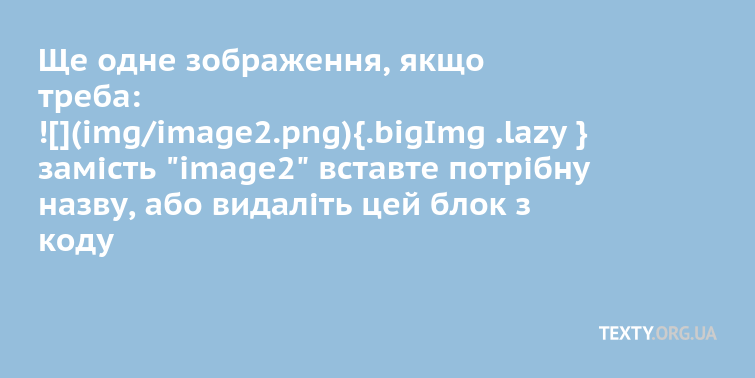

<!-- не редагуємо -->
```{r installpackages, include=FALSE }
#завантажить необхідні пакети, якщо вони відсутні
list.of.packages <- c('RCurl', 'ggplot2', 'rlang', 'readr', 'tidyverse', 'hrbrthemes', 'knitr', 'gridExtra', 'grid')
new.packages <- list.of.packages[!(list.of.packages %in% installed.packages()[,"Package"])]
if(length(new.packages)) install.packages(new.packages, repos = "http://cran.us.r-project.org", dependencies = TRUE)
```

<!-- не редагуємо -->
```{r pandoc, include=FALSE }
source("TemplateToPandoc.R")
user <- Sys.info()[["user"]]
path = paste0('/home/', user, '/Desktop')
#для запуску функції треба прописати шлях для створення папки(1) і назву проекту(2)
TemplateToPandoc(path, 'Rmd')
```

<!-- не редагуємо -->
```{r dir, include=FALSE }
source("createDir.R")
user <- Sys.info()[["user"]]
path = paste0('/home/', user, '/Desktop')
#для запуску функції треба прописати шлях для створення папки(1) і назву проекту(2)
createDirs(path, 'Rmd')
```


<!-- редагуємо за потреби, код змінює колір лого, соц іконок і overlay заставочного зображення -->
```{js, echo=FALSE } 
jQuery('svg#facebook')
  .css("fill", "white")
jQuery('svg#twitter')
  .css("fill", "white")
jQuery('svg#logo')
  .css("fill", "white")
jQuery('#overlay')
  .css("background-color", "black")
  .css("opacity", "0.5")
``` 

Абзац
Lorem ipsum dolor sit amet, consectetur adipiscing elit. Donec ex leo, sollicitudin ut est facilisis, vulputate aliquam felis. Fusce non iaculis metus. Aliquam nec facilisis enim. Proin quis risus fermentum, iaculis tellus at, lobortis mi. Nullam sapien elit, sollicitudin non porttitor quis, accumsan sed elit. Aenean dignissim lacus ac felis tincidunt interdum. Quisque vel pellentesque elit, id pulvinar quam. Quisque at mi consequat diam tincidunt placerat non eleifend diam. Nulla placerat quis neque ut faucibus. Duis ornare tellus nec dapibus faucibus. Vestibulum arcu nunc, pulvinar quis maximus in, dictum eget nibh. Vivamus eu cursus magna, ut eleifend enim. Etiam a pharetra ante. Class aptent taciti sociosqu ad litora torquent per conubia nostra, per inceptos himenaeos.


<!-- Додаємо зображення:  -->
<div class='bigImg'>
{.bigImg .lazy } 
</div>
<!-- замість "image.png" вставте потрібну назву  -->

Ще кілька абзаців
Lorem ipsum dolor sit amet, consectetur adipiscing elit. Donec ex leo, sollicitudin ut est facilisis, vulputate aliquam felis. Fusce non iaculis metus. Aliquam nec facilisis enim. Proin quis risus fermentum, iaculis tellus at, lobortis mi. Nullam sapien elit, sollicitudin non porttitor quis, accumsan sed elit. Aenean dignissim lacus ac felis tincidunt interdum. Quisque vel pellentesque elit, id pulvinar quam. Quisque at mi consequat diam tincidunt placerat non eleifend diam. Nulla placerat quis neque ut faucibus. Duis ornare tellus nec dapibus faucibus. Vestibulum arcu nunc, pulvinar quis maximus in, dictum eget nibh. Vivamus eu cursus magna, ut eleifend enim. Etiam a pharetra ante. Class aptent taciti sociosqu ad litora torquent per conubia nostra, per inceptos himenaeos.

Lorem ipsum dolor sit amet, consectetur adipiscing elit. Donec ex leo, sollicitudin ut est facilisis, vulputate aliquam felis. Fusce non iaculis metus. Aliquam nec facilisis enim. Proin quis risus fermentum, iaculis tellus at, lobortis mi. Nullam sapien elit, sollicitudin non porttitor quis, accumsan sed elit. Aenean dignissim lacus ac felis tincidunt interdum. Quisque vel pellentesque elit, id pulvinar quam. Quisque at mi consequat diam tincidunt placerat non eleifend diam. Nulla placerat quis neque ut faucibus. Duis ornare tellus nec dapibus faucibus. Vestibulum arcu nunc, pulvinar quis maximus in, dictum eget nibh. Vivamus eu cursus magna, ut eleifend enim. Etiam a pharetra ante. Class aptent taciti sociosqu ad litora torquent per conubia nostra, per inceptos himenaeos.


<!-- Ще одне зображення, якщо треба:  -->
<div class='bigImg'>
{.bigImg .lazy }<!-- Видаліть цю строчку, якщо друга картинка не потрібна --> 
</div>
<!-- замість "image2.png" вставте потрібну назву  -->

Абзац
Lorem ipsum dolor sit amet, consectetur adipiscing elit. Donec ex leo, sollicitudin ut est facilisis, vulputate aliquam felis. Fusce non iaculis metus. Aliquam nec facilisis enim. Proin quis risus fermentum, iaculis tellus at, lobortis mi. Nullam sapien elit, sollicitudin non porttitor quis, accumsan sed elit. Aenean dignissim lacus ac felis tincidunt interdum. Quisque vel pellentesque elit, id pulvinar quam. Quisque at mi consequat diam tincidunt placerat non eleifend diam. Nulla placerat quis neque ut faucibus. Duis ornare tellus nec dapibus faucibus. Vestibulum arcu nunc, pulvinar quis maximus in, dictum eget nibh. Vivamus eu cursus magna, ut eleifend enim. Etiam a pharetra ante. Class aptent taciti sociosqu ad litora torquent per conubia nostra, per inceptos himenaeos.


<!-- не редагуємо, цей скрипт прибирає зайві <p> теги, перед зображеннями, а також додає клас lazy (зображення вантажиться, коли воно потрапляє у vievport) -->

```{js, echo=FALSE }
jQuery('div.bigImg p')
  .contents()
  .unwrap();
jQuery('.bigImg img')
  .addClass('lazy')
``` 

