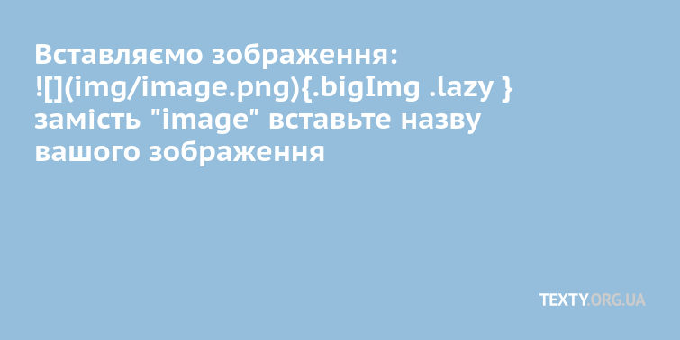

Код для автоматичного створення простої текстівської верстки. Приклад за лінком: https://texty.github.io/Rmakrdown/

Для початку роботи, завантажте папку Rmd на робочий стіл і відкритейте файл runFirst.Rmd.
Відредагуйте файл відповідно до потреб та запустіть команду "Knit"

**Перепишіть значення змінних для макету у файлі runFirst.Rmd**

page_url: http://texty.org.ua/d/2018/test-project #лінк на ваш проект

page_title: "Заголовок статті, який буде відображатись в соцмережах" 

description: "Опис статті, який буде відображатись в соцмережах"

title: "Заголовок статті"

subtitle: "Аннотация до статті. Пару вступних реченнь"

authors: "імʼя автора"

published: "дата публікації"

read_more1: http://texty.org.ua/d/2018/amber/ #лінк-посилання на попередній проект

read_more1_alt: "опис першого лінку, наприклад 'авіація' або його назва"

read_more2: http://texty.org.ua/d/auto_euro/ #лінк-посилання на попередній проект

read_more2_alt: "опис другого лінку, наприклад 'бурштин'або його назва"

read_more3: http://texty.org.ua/d/urban-heat-web/ #лінк-посилання на попередній проект

read_more3_alt: "опис третього лінку"

**Замість Lorem ipsum на потрібний текст**

Lorem ipsum dolor sit amet, consectetur adipiscing elit. Donec ex leo, sollicitudin ut est facilisis, vulputate aliquam felis. Fusce non iaculis metus. Aliquam nec facilisis enim. Proin quis risus fermentum, iaculis tellus at, lobortis mi. Nullam sapien elit, sollicitudin non porttitor quis, accumsan sed elit. Aenean dignissim lacus ac felis tincidunt interdum. Quisque vel pellentesque elit, id pulvinar quam. Quisque at mi consequat diam tincidunt placerat non eleifend diam. Nulla placerat quis neque ut faucibus. Duis ornare tellus nec dapibus faucibus. Vestibulum arcu nunc, pulvinar quis maximus in, dictum eget nibh. Vivamus eu cursus magna, ut eleifend enim. Etiam a pharetra ante. Class aptent taciti sociosqu ad litora torquent per conubia nostra, per inceptos himenaeos.

**Додайте потрібні зображення:**

{.bigImg .lazy } 

**Замість "image.png" вставте потрібну назву**

Щоб згенерувати посилання на інші матеріали для read-more.png, використовуйте http://z.texty.org.ua:4567/

